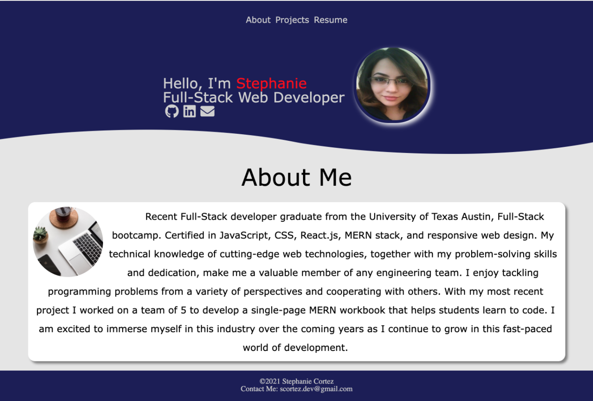
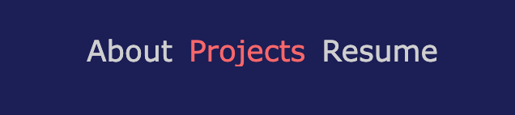
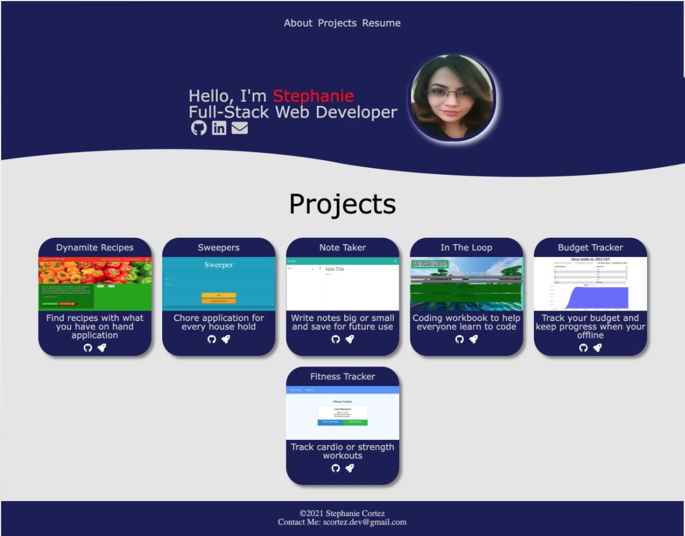
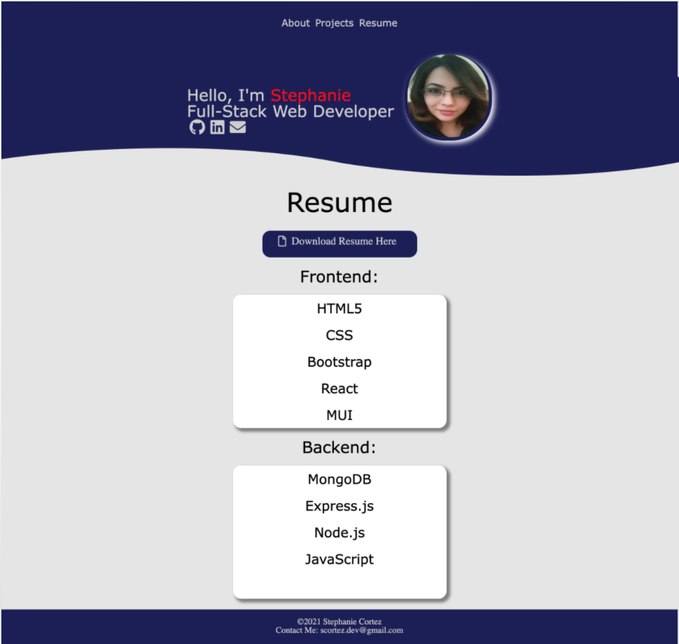

#  Portfolio using REACT

##  In this project I will be creating a portfolio using REACT!
[View the deployed portfolio here](https://stephanies-react-portfolio.herokuapp.com/)
### Table of contents
- [Installation](#installation)
- [Usage](#usage)
- [Contributors](#contributors)
- [License](#license)
### Installation
To install please `npm i` if your package json doesnt have a package lock. Then to display the project in the localhost `npm start`.
### Usage
The default page you will be presented with is the about me page. On this page you can see a navbar with links to resume, about me and project page. All of the links are active and will direct you to their url on a different tab. 

When you hover over the navbar links the color changes to a muted red for better UI experience.
  
On the project page there are six projects with the github icon leading to the github repository and the rocket ship icon that will direct you to the deployed project.

Finally, the resume page lists front and backend technologies and languages.

## License
This repository is covered by the MIT License    
https://opensource.org/licenses/MIT
#### Contributors
Ethan Cho, Damien Luzzo
#### Test Instructions
There was no testing on this project.
##### Contact
GitHub: [CortezStephanie](https://github.com/CortezStephanie)
